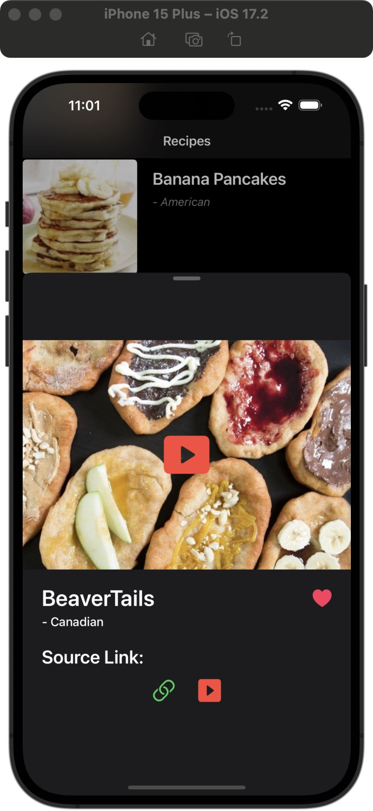
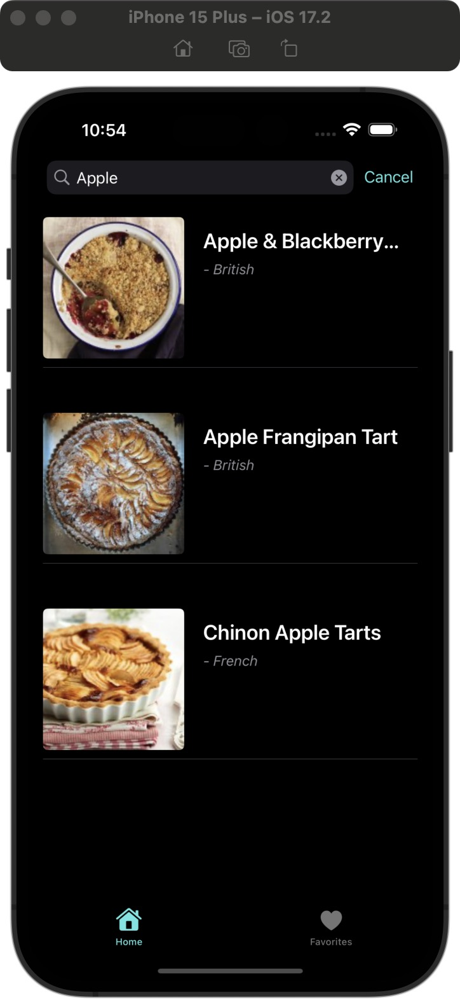
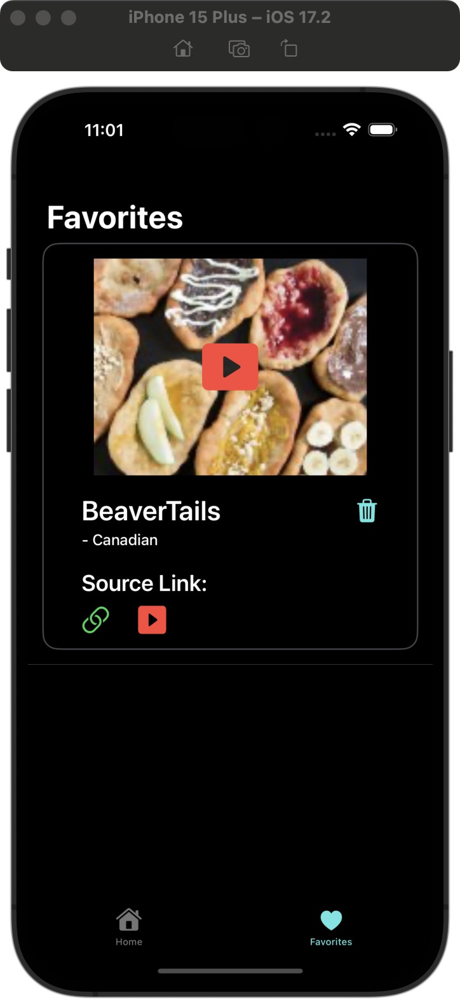

### Summary:

This project is a recipe browsing app built using the MVVM architecture with SwiftUI. It fetches data from a public
API,making integration fast and straightforward.

- **Architecture**: Built with MVVM pattern to practice separation of concerns
- **Data Management**: 
  - Fetches data from public API using **asyn/await**
  - Implements **Core Data** for local persistence (favorites feature)
- **Key Features**:
  - Dynamic search functionality
  - URL link handling to original recipes
  - Reusable UI components

### App Screenshots

  
Home Page

  

  
Recipe Detail View

  

  
Search Results

  

  
Favorites Page

  

    
### Focus Areas: 

In this project, I mainly focused on **Core Data** and the **MVVM architecture**.Core Data allows the app to store user
favorites locally, so the data stays even after the app is closed. MVVM helps separate data logic from the UI, making the
code easier to read, test, and maintain. I chose these areas because they are key skills in iOS development and help create
a more stable and scalable app.

---
    

### Time Spent:

- UI: 4 hours
- API and CoreData: 4 hours
- MVVM Architecture: 1 hour
- Debugging And Testing: 3 hours
Total: 12 hours

I usually plan in advance when I aim to complete each part of the project, and I allocate time for debugging throughout
each stage of the development process.

---

### Trade-offs and Decisions: 

I made a significant trade-off in how I handled data storage. In the beginning, I used local structs for simplicity, but
later I decided to integrate Core Data to enable data persistence and provide a convenient way for users to save their
favorite recipes.

---

### Weakest Part of the Project: 

I think the weakest part of my project is the frontend UI design compared to the backend. because I focused more on the
backend logic and spent less time polishing the visuals. 

---

### Additional Information: 
    
Throughout this project, I learned how to maintain a clear separation between the logic and the view. especially in larger
applications. I used the **MVVM architecture** to structure the app in a way that makes it easier to manage and scale.which
I was able to keep the logic and UI code independent, and making maintenance and testing much more efficient.
  
One of the biggest challenges I faced was **handling concurrency** and **thread management**, which is essential in iOS
development.  I used async/await to manage background tasks and ensure smooth UI updates without blocking the main thread.
 
Overall, this experience really helped me grow as an iOS developer. And I am looking forware to apply my skill in the Company

---

### 🛠️ Technologies Used  
- **Languages**: Swift  
- **Frameworks**: SwiftUI, Core Data  
- **Tools**: Xcode, Git  
