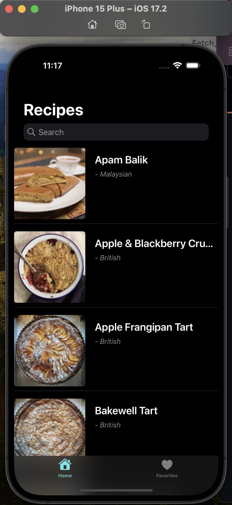

### Summary: 
    This project is a recipe browsing app built using the MVVM architecture with SwiftUI. It fetches data from a public
    API, making integration fast and straightforward.
    
- **Favorites with Core Data**  
  Users can save their favorite recipes locally. The app uses Core Data to persist data, so favorites remain available even after restarting the app.

- **Search Functionality**  
  Users can search for recipes by keywords, making it easier to find what they’re looking for.

- **Direct Links**  
  Each recipe includes a clickable link that takes users directly to the original source or YouTube link for demo or instructions.

- **Reusable UI Components**  
  Custom card views are used for better UI consistency and to improve code reuse across different parts of the app.
  

### ScreenShoots:

  

    
Home Page

    
  

  

    
Detail View

    
  

  

    
Search Result

    
  

  

    
Favorites Page

    
  

---
    
### Focus Areas: What specific areas of the project did you prioritize? Why did you choose to focus on these areas?

In this project, I mainly focused on **Core Data** and the **MVVM architecture**.Core Data allows the app to store user
favorites locally, so the data stays even after the app is closed. MVVM helps separate data logic from the UI, making the
code easier to read, test, and maintain. I chose these areas because they are key skills in iOS development and help create a more stable and scalable app.

---
    

### Time Spent: Approximately how long did you spend working on this project? How did you allocate your time?

### Trade-offs and Decisions: Did you make any significant trade-offs in your approach?

### Weakest Part of the Project: What do you think is the weakest part of your project?

### Additional Information: Is there anything else we should know? Feel free to share any insights or constraints you encountered.
